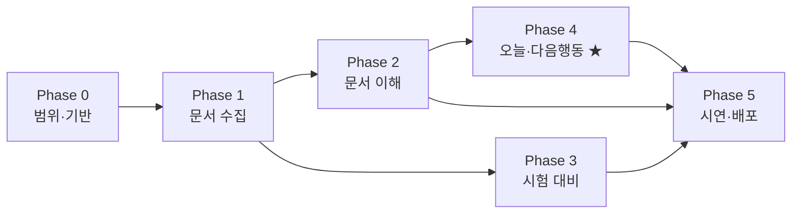

# AI StudyMate — Phase 로드맵 (간소 PRD)

> **용도:** 이틀 POC를 Phase 단위 PRD로 정의 · 심사표(100점) 대응  
> **경로:** `c:\Users\jeung\jeung`  
> **기준일:** 2026-07-10 (KST)  
> **합의:** 기능 추가 중단 · IA·시연·메시지·비전만 고정

---

## 1. 제품 정의

### 태그라인 (발표 첫 문장)

**오늘 무엇을 공부할지 먼저 알려주는 AI 학습 도우미**

### 한 줄

강의자료·과목·시험일을 제품 상태로 남기고, 앱을 연 순간 **다음에 할 행동**을 먼저 제안한다.

### 본질 vs POC 화면 (혼동 금지)

| 층 | 정의 | 비고 |
| --- | --- | --- |
| **제품 본질** | 학생의 **다음 행동(Decision)** 을 돕는 것 | LMS·과제로 확장해도 유지 |
| **POC 핵심 화면** | **오늘(Today)** | 시험 시즌에 결정을 가장 잘 보여주는 UI |
| **AI의 역할** | 기능을 나열하는 주체가 아니라, **결정을 채우는 엔진** | 요약·Q&A·plan은 엔진 부품 |

> Today는 이번 POC의 홈이다. 제품 이름 자체가 「오늘」이 될 필요는 없다.  
> 시험 이후에도 「다음 과목·다음 시험·다음 목표」로 같은 본질이 이어진다.

### 차별점 (발표용 · 최소 2회)

**공부를 시작하는 순간, 무엇부터 해야 할지 알려주는 AI 학습 도우미 
StudyMate는 그 순간 가장 먼저 해야 할 행동을 제안한다.**

| | GPT / Projects | StudyMate |
| --- | --- | --- |
| 기본 인터페이스 | 질문·채팅 | **다음 행동(오늘 화면)** |
| 사용 맥락 | 물을 때 움직인다 | **열면** 이미 할 일이 있다 |
| 맥락 | 매 세션 다시 조립하거나 Project에 묶임 | 과목·시험일·자료가 **제품 상태**로 남음 |

**계층:** `State(저장된 맥락) → Workflow(열면 제안) → Today's Action(POC 화면)`

**시연으로 증명할 한 컷:** 시험일 D-5 ↔ D-2 → **오늘 할 일이 바뀐다.**

---

## 2. 심사표 대응 전략 (100점)

| 평가 항목 (20점) | 무엇을 보여줄지 | 이 문서·산출물 |
| --- | --- | --- |
| **문제 정의·기획** | 질문형 도구 vs **공부 시작형 AI 도우미** · PRD 완결 | §1 · IN/OUT · 시연 |
| **구현 완성도** | 라이브 무중단 · fallback | P1~P5 DoD · 캐시 · 붙여넣기 |
| **AI 활용도** | 역할 분리: 요약 · 근거 Q&A · (보너스)퀴즈 · 일정 반영 plan | API 계약 · 발표 서사 |
| **창의성·실용성** | 기능 나열이 아니라 **다음 행동 기본 화면** | 오늘 홈 · D-day 시연 |
| **발표·전달력** | 학생→행동→AI 서사 · Q&A · 비전 1장 | §10~11 |

**하드 패스:** `P0 → P1 → P2 → P4 → P5`  
**보너스:** `P3` — Day2 남는 시간에만  
**이 시점 이후:** 신규 AI 기능·가짜 대시보드(진도% 등) 추가 금지. **보여주는 방식만** 다듬는다.

---

## 3. IA · 오늘 화면 설계

### 탭 (사용자 목표 순)

| 탭 | 역할 |
| --- | --- |
| **오늘** | 다음 행동의 기본 화면 (홈) |
| **자료** | PDF 업로드 · 요약 |
| **질문** | 자료 근거 Q&A |
| **시험** | 문제 생성 (보너스 · 홈 필수 동선 아님) |

### 오늘 홈 — 넣을 것 / 넣지 말 것

| IN (필수) | OUT (POC 금지) |
| --- | --- |
| 과목명 | 진도율·완료율·학습량 % |
| D-day 배지 | AI 점수·중요도 별점 UI |
| 오늘 할 일 **2~3개** | 퀴즈를 오늘 필수 카드로 고정 |
| CTA **「오늘 공부 시작하기」** | 완료→내일 자동 갱신 루프(미구현) |

**오늘 할 일 예시 (퀴즈 없이도 성립)**

1. 운영체제 핵심 요약 읽기  
2. 추천 질문: 프로세스 vs 스레드  
3. (선택) D-day에 맞는 복습 한 줄  

CTA는 자료 요약 또는 첫 할 일로 이동하면 된다.

---

## 4. Phase 개요

| Phase | 명칭 | 한 줄 목표 | 심사 기여 |
| ----- | --- | --- | --- |
| **0** | 범위·기반 고정 | 제품 정의·스택·데모 값 확정 | 기획 |
| **1** | 문서 수집 | PDF → 텍스트 저장 | 구현 |
| **2** | 문서 이해 | 요약 + Q&A | AI · 구현 |
| **3** | 시험 대비 (보너스) | 객관식·OX | AI 가점 |
| **4** | 다음 행동 · 오늘 홈 ★ | 일정 반영 plan + 오늘 화면 | 창의·실용 |
| **5** | 시연·배포 | 안정화·발표·비전 | 구현 · 발표 |



**의존:** `0 → 1 → 2 → 4` 필수 · `3` 후순위 → `5`  
**최소 시연:** 0 + 1 + 2 + 4 + 5

**발표 서사 (아키텍처 설명 순서와 다름):**

```
학생 → 다음 행동 결정 → 필요한 AI 호출 → 결과
```

기능→AI→기능 나열로 설명하지 않는다.

---

## 5. Day1 / Day2 시간표

| 구간 | Phase | 끝내는 기준 |
| --- | --- | --- |
| **Day1 오전** | P0 + P1 | 데모 PDF 업로드 · 미리보기 · 붙여넣기 · `npm run dev` |
| **Day1 오후** | P2 | 요약 · «프로세스 vs 스레드» · **오늘/자료/질문/시험** 탭 골격 |
| **Day2 오전** | **P4** | 오늘 홈(과목·D-day·할 일·CTA) · plan · D-5↔D-2 변화 |
| **Day2 오후** | P5 → 여유 시 P3 | 캐시 · 배포/녹화 · 리허설 ≥3 · 남으면 퀴즈 |

**규칙:** Day2 오전에 P3 금지. 오늘 홈에 퀴즈 필수 카드 금지.

---

## 6. 전역 범위

| IN (POC) | OUT (향후) | 왜 |
| --- | --- | --- |
| PDF · 요약 · Q&A | 로그인·멀티유저 | 시연 안정성 |
| 과목·시험일 · **오늘 홈** · plan ★ | pgvector·Embedding | full-context POC |
| 퀴즈 (보너스) | PPT·LMS·공지·과제 **구현** | 비전은 슬라이드만 |
| URL 또는 녹화 | 진도 DB·약점 분석·E2E | 가짜 대시보드 방지 |

**스택:** Next.js · Tailwind · Route Handlers · pdf-parse · OpenAI · localStorage · Vercel

**AI 방식:** Embedding/RAG 없음. 추출 텍스트 truncate 후 full-context.  
역할: 요약 · 근거 Q&A · (보너스)퀴즈 · 일정 반영 plan.  
**데모 PDF ≤15p** 기준으로 설계했다고 먼저 말한다.

---

## 7. 데모 고정값 (FR-0.2)

시연 전 **변경 금지**. Day1 오전에 채운다.

| 항목 | 고정값 |
| --- | --- |
| 데모 PDF | `os-demo.pdf` · ≤15p · 추출 가능 |
| 과목 | 운영체제 |
| 시험일 | **오늘 + 5일** → UI D-5 |
| 질문 1 | 프로세스와 스레드 차이가 뭐야? |
| 질문 2 | (자료 키워드 1개 — Day1 확정) |
| 질문 3 | (자료 밖 1개 → «자료에 없습니다») |
| 핵심 시연 | D-5 ↔ D-2 → **오늘 할 일** 변화 |

---

## 8. Phase PRD

### Phase 0 — 범위·기반 고정

| 항목 | 내용 |
| --- | --- |
| **목적** | 제품 정의·범위·스택·데모·시연 스토리 고정 |
| **심사** | 문제 정의·기획 |

**사용자 스토리**

- 개발자로서 POC 범위와 **오늘 홈 스펙**을 알고 구현하고 싶다.
- 발표자로서 «공부 시작을 위해 연다» 메시지만 시연하고 싶다.

**요구사항**

| ID | 요구사항 |
| --- | --- |
| FR-0.1 | IN/OUT·심사 대응·§1 제품 정의 합의 |
| FR-0.2 | §7 데모 고정값 확정 |
| FR-0.3 | Next.js · `OPENAI_API_KEY` · git |
| FR-0.4 | IA: **오늘 / 자료 / 질문 / 시험** + API 5개 이름 |

**DoD**

- [ ] 태그라인·차별점 문장 확정
- [ ] 시연 단계 ↔ 범위 1:1
- [ ] `npm run dev` 기동

**리스크:** 범위 재논의 → Phase 0 컷 후 변경 금지

---

### Phase 1 — 문서 수집

| 항목 | 내용 |
| --- | --- |
| **목적** | PDF → 텍스트 (AI 입력) |
| **심사** | 구현 |

**요구사항**

| ID | 요구사항 |
| --- | --- |
| FR-1.1 | 자료 탭 PDF 업로드 |
| FR-1.2 | `POST /api/upload` — pdf-parse |
| FR-1.3 | `extractedText` → state + localStorage |
| FR-1.4 | 미리보기 앞 500자 + 더 보기 |
| FR-1.5 | 실패 시 에러 · «텍스트 붙여넣기» |
| FR-1.6 | PDF ≤5MB · 텍스트 ≤12,000자 truncate |

**DoD:** 데모 PDF 표시 · 새로고침 유지 · 비PDF 오류 · 붙여넣기 fallback

---

### Phase 2 — 문서 이해

| 항목 | 내용 |
| --- | --- |
| **목적** | 요약 + 근거 Q&A (오늘 할 일의 재료) |
| **심사** | AI · 구현 |

**요구사항**

| ID | 요구사항 |
| --- | --- |
| FR-2.1 | `POST /api/summarize` → `{ keywords[], concepts[], easyExplain }` |
| FR-2.2 | 자료 탭 «요약하기» |
| FR-2.3 | `cache/summarize.json` |
| FR-2.4 | `POST /api/chat` — 자료만 근거, 없으면 «자료에 없습니다» |
| FR-2.5 | 질문 탭 채팅 |
| FR-2.6 | 4탭 · 로딩 · 에러 |

**DoD:** 요약 성공 · 질문 1 답변 · 자료 밖 거절 · 빈 상태 · 탭 전환

---

### Phase 3 — 시험 대비 (보너스)

| 항목 | 내용 |
| --- | --- |
| **목적** | 객관식·OX — **오늘 홈 필수 아님** |
| **심사** | AI 가점 (P4·P5 이후) |

**요구사항:** `POST /api/quiz` · 시험 탭 · 카드 또는 JSON · `cache/quiz.json`

**DoD:** MCQ≥3 · OX≥2 · 파싱 실패 시 재생성 · 텍스트 없으면 비활성  
**우선순위:** Phase 4·5 이후

---

### Phase 4 — 다음 행동 · 오늘 홈 ★

| 항목 | 내용 |
| --- | --- |
| **목적** | 저장된 맥락으로 **오늘 할 일**을 기본 화면에 표시 |
| **심사** | 창의성·실용성 · AI |

**사용자 스토리**

- 학생으로서 앱을 열면 **질문하기 전에** 오늘 무엇을 할지 보고 싶다.
- 시험이 다가오면 오늘 할 일이 바뀌는 것을 확인하고 싶다.

**요구사항**

| ID | 요구사항 |
| --- | --- |
| FR-4.1 | **오늘** 탭: 과목 input · 시험일 picker |
| FR-4.2 | D-day 배지 |
| FR-4.3 | `POST /api/plan` → `{ today[], days[] }` |
| FR-4.4 | 오늘 할 일 2~3개 렌더 · CTA «오늘 공부 시작하기» |
| FR-4.5 | 요약 키워드를 plan 프롬프트에 포함 |
| FR-4.6 | profile·plan localStorage + `cache/plan.json` |
| FR-4.7 | D-5 ↔ D-2 재생성으로 오늘 할 일 변화 시연 |
| FR-4.8 | 퀴즈·진도%를 오늘 필수 UI에 넣지 않음 |

**DoD**

- [ ] 운영체제 + D-5 → plan + 오늘 하이라이트
- [ ] D-5 ↔ D-2 시 오늘 할 일 차이 시연
- [ ] 차별점 문장(§1)으로 설명 가능
- [ ] 퀴즈 없이도 오늘 홈 완결

**우선순위:** Phase 3보다 먼저

---

### Phase 5 — 시연·배포

| 항목 | 내용 |
| --- | --- |
| **목적** | 시연·발표·Q&A 무중단 · 확장 비전 1장 |
| **심사** | 구현 · 발표 |

**요구사항**

| ID | 요구사항 |
| --- | --- |
| FR-5.1 | summarize·chat·quiz·plan 캐시 fallback |
| FR-5.2 | 로딩·빈 상태 통일 |
| FR-5.3 | Vercel + env (또는 로컬 + 녹화) |
| FR-5.4 | README (실행·시연) |
| FR-5.5 | 슬라이드 5장 (§10) |
| FR-5.6 | 리허설 ≥3 · 백업 녹화 2분 |
| FR-5.7 | Q&A 표 (§11) |

**DoD:** 시연 ≥5/7 · 오늘·D-day 컷 포함 · URL 또는 녹화 · fallback 리허설  
**Phase 5 이후 신규 기능 금지**

---

## 9. API · UI 매핑 · 계약

| API | Phase | 탭 | Request | Response |
| --- | --- | --- | --- | --- |
| `/api/upload` | 1 | 자료 | `multipart` | `{ text, truncated }` |
| `/api/summarize` | 2 | 자료 | `{ text }` | `{ keywords[], concepts[], easyExplain }` |
| `/api/chat` | 2 | 질문 | `{ text, question }` | `{ answer, grounded }` |
| `/api/quiz` | 3 | 시험 | `{ text }` | `{ mcq[], ox[] }` |
| `/api/plan` | 4 | **오늘** | `{ subject, examDate, keywords[] }` | `{ today[], days[] }` |

**공통:** JSON only(요약·퀴즈·plan) · 파싱 실패 1회 재시도 후 캐시 · chat은 자료 근거 강제 · 목표 ≤15초

---

## 10. 시연 스크립트 (5분) · 실패 백업

| # | 멘트·동작 | Phase | 실패 시 |
| --- | --- | --- | --- |
| 1 | **공부 시작을 위해 연다** / GPT는 질문 도구 | — | 슬라이드 |
| 2 | **오늘** 홈: 운영체제 · D-5 · 할 일 · CTA | P4 | localStorage 프리셋 |
| 3 | 자료: PDF → 요약 | P1–2 | 붙여넣기 · `cache/summarize.json` |
| 4 | 질문: 프로세스 vs 스레드 | P2 | 캐시/사전 답 |
| 5 | 시험: 문제 생성 *(없으면 스킵)* | P3 | 스킵 멘트 · `cache/quiz.json` |
| 6 | **오늘**: D-2로 바꿔 할 일 변화 | P4 | `cache/plan.json` |
| 7 | 현재=PDF+시험일 / 향후=LMS·공지·과제 · Q&A | P5 | — |

**P3 스킵 멘트:** «퀴즈는 같은 파이프라인으로 확장 가능. 오늘은 **다음 행동을 먼저 보여주는 홈**에 집중했습니다.»

---

## 11. 슬라이드 5장

1. **문제** — 자료·일정이 흩어짐 · 학생은 «오늘 뭐 하지?»에서 막힘  
2. **해결** — 태그라인 + 차별점 문장(§1)  
3. **데모** — 오늘 홈 · D-day 변경 컷  
4. **AI** — 학생→다음 행동→AI 호출 · 역할 분리 · full-context(≤15p) · 향후 RAG  
5. **현재 → 향후**  
   - 현재: PDF + 과목 + 시험일 → **오늘 할 일**  
   - 향후: + LMS · 공지 · 과제 → 같은 **다음 행동** 엔진  
   - (말만) 재방문 시 추천·복습 순·질문 추천이 날짜에 따라 더 정교해짐

---

## 12. Q&A 예상 답

| 질문 | 한 줄 답 |
| --- | --- |
| GPT랑 뭐가 다른가요? | GPT는 **질문하면** 답한다. 우리는 **공부를 시작하려고 열면** 오늘 할 일이 먼저 있다. |
| Projects/Memory면 되지 않나요? | 그건 여전히 **채팅이 기본**. 우리는 **다음 행동이 기본 화면**이다. |
| 왜 별도 웹서비스인가요? | 질문 도구가 아니라 **공부 시작 AI 도우미**이 필요해서다. |
| RAG 안 쓰나요? | POC는 ≤15p full-context. 커지면 벡터 검색으로 확장. |
| PDF가 100페이지면? | 현재는 데모 분량 기준. 다음은 RAG. |
| 왜 로그인 없나요? | 이틀 POC 안정성. API는 분리해 두었다. |
| 환각은? | 자료 근거 강제 · 없으면 «자료에 없습니다». |
| LMS는? | 구현 OUT. 비전: 공지·과제를 같은 plan/오늘 엔진에 연결. |

---

## 13. 일정 부족 시 우선순위

```
P0  Phase 0, 1, 2, 4, 5   ← 오늘 홈 + 차별점 시연
P1  Phase 3                 ← 퀴즈 가점
P2  오늘 홈 카피·CTA 폴리싱
P3  스트리밍·퀴즈 카드
```

---

## 14. 성공 지표

| 심사 | 통과 |
| --- | --- |
| 기획 | §1 본질/Today 구분 · IN/OUT · 태그라인 |
| 구현 | 시연 ≥5/7 · fallback 리허설 |
| AI | 요약+Q&A+plan · 역할 설명 가능 |
| 창의·실용 | D-day 변경 → 오늘 할 일 변화 |
| 발표 | 슬라이드 5장 · 차별점 문장 ≥2회 · 비전 1장 |

- Phase 5 이후 **신규 기능 추가 금지**  
- 진도%·필수 퀴즈 홈·완료 자동화 **구현하지 않음**

---

*문서 이력*  
*2026-07-09 — Day1/Day2 → Phase 0~5*  
*2026-07-10 — 심사표 · Day 배분 · API 계약 · 실패 백업*  
*2026-07-10 — 합의안: 제품 본질=다음 행동 · POC 화면=오늘 · IA·태그라인·시연·비전 고정 · 기능 추가 중단*
